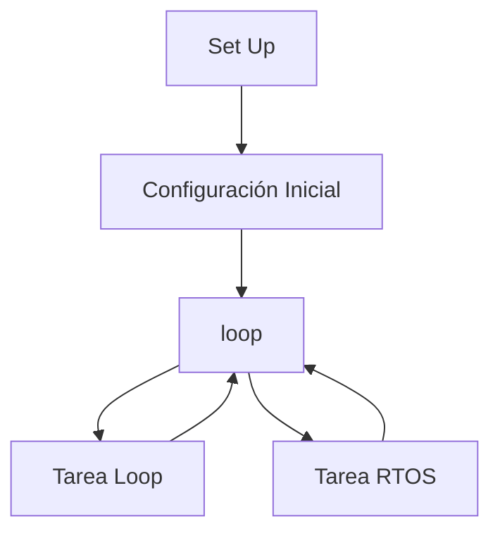
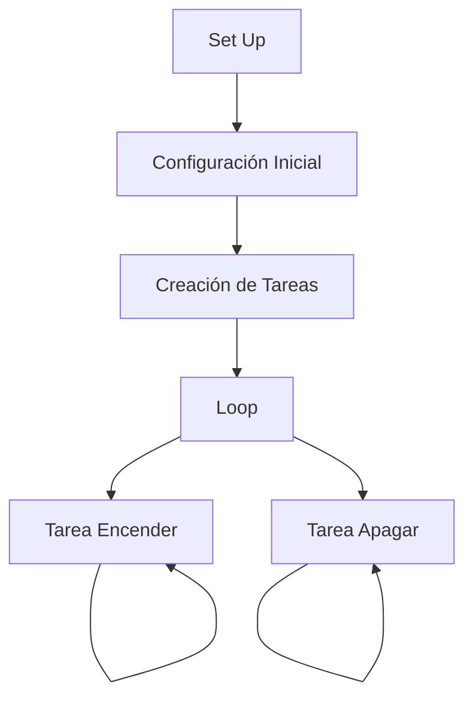

# Informe de la Práctica 4: Sistemas Operativos en Tiempo Real

## Introducción

En esta práctica, hemos explorado el funcionamiento de un sistema operativo en tiempo real utilizando el ESP32 y FreeRTOS. Se han creado varias tareas para entender cómo se ejecutan de manera concurrente y cómo se gestiona el tiempo de CPU.

## Ejercicio Práctico A: 

### Código para la práctica A

```cpp
#include <Arduino.h>
#include <FreeRTOS.h>
#include <task.h>

/* this function will be invoked when additionalTask was created */
void anotherTask( void * parameter ) {
  /* loop forever */
  for(;;) {
    Serial.println("this is another Task");
    vTaskDelay(1000);
  }

  /* delete a task when finish,
  this will never happen because this is infinity loop */
  vTaskDelete( NULL );
}

void setup() {
  Serial.begin(112500);
  /* we create a new task here */
  xTaskCreate(
    anotherTask, /* Task function. */
    "another Task", /* name of task. */
    10000, /* Stack size of task */
    NULL, /* parameter of the task */
    1, /* priority of the task */
    NULL
  ); /* Task handle to keep track of created task */
}

/* the forever loop() function is invoked by Arduino ESP32 loopTask */
void loop() {
  Serial.println("this is ESP32 Task");
  delay(1000);
}
```


### Descripción de la Salida por el Puerto Serie

La salida por el puerto serie muestra dos líneas de mensajes que se imprimen cada segundo:

```
this is ESP32 Task
this is another Task
```


### Explicación del Funcionamiento

El código proporcionado crea dos tareas utilizando FreeRTOS: una tarea principal en el `loop()` y otra tarea adicional llamada `anotherTask()`. Ambas tareas imprimen un mensaje por el puerto serie cada segundo.



## Ejercicio Práctico B: 

### Código para la práctica B

```cpp
#include <Arduino.h>
#include <FreeRTOS.h>
#include <task.h>
#include <semphr.h> 

const int ledPin = 15;

void tareaEncender(void *parameter);
void tareaApagar(void *parameter);

SemaphoreHandle_t semaforo;

void setup() {
  Serial.begin(115200);
  pinMode(ledPin, OUTPUT);

  semaforo = xSemaphoreCreateBinary();
  
  xTaskCreate(tareaEncender, "Encender LED", 1000, NULL, 1, NULL);
  xTaskCreate(tareaApagar, "Apagar LED", 1000, NULL, 1, NULL);
}

void loop() {
  // No hay código en el loop
}

void tareaEncender(void *parameter) {
  for (;;) {
    xSemaphoreTake(semaforo, portMAX_DELAY);

    digitalWrite(ledPin, HIGH);
    Serial.println("LED Encendido");
    vTaskDelay(pdMS_TO_TICKS(1000)); // Paramos la tarea durante un segundo
  }
}

void tareaApagar(void *parameter) {
  for (;;) {
    xSemaphoreTake(semaforo, portMAX_DELAY);

    digitalWrite(ledPin, LOW);
    Serial.println("LED Apagado");
    vTaskDelay(pdMS_TO_TICKS(1000)); // Paramos la tarea durante un segundo
  }
}
```

### Descripción de la Salida por el Puerto Serie

La salida por el puerto serie muestra los siguientes mensajes en función de las tareas que se ejecutan:

```cpp
LED Encendido
LED Apagado
```


### Explicación del Funcionamiento

El código implementa dos tareas utilizando FreeRTOS: `tareaEncender` y `tareaApagar`. Ambas tareas intentan tomar un semáforo para controlar el acceso al LED. Solo una tarea puede encender o apagar el LED a la vez, garantizando una sincronización correcta mediante el semáforo.

